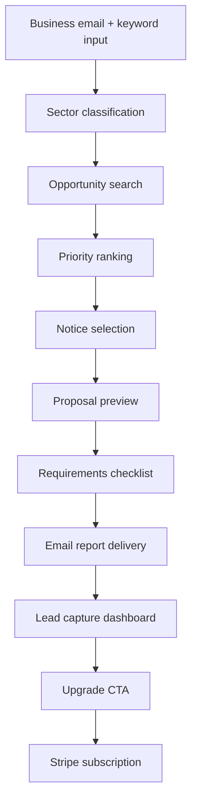
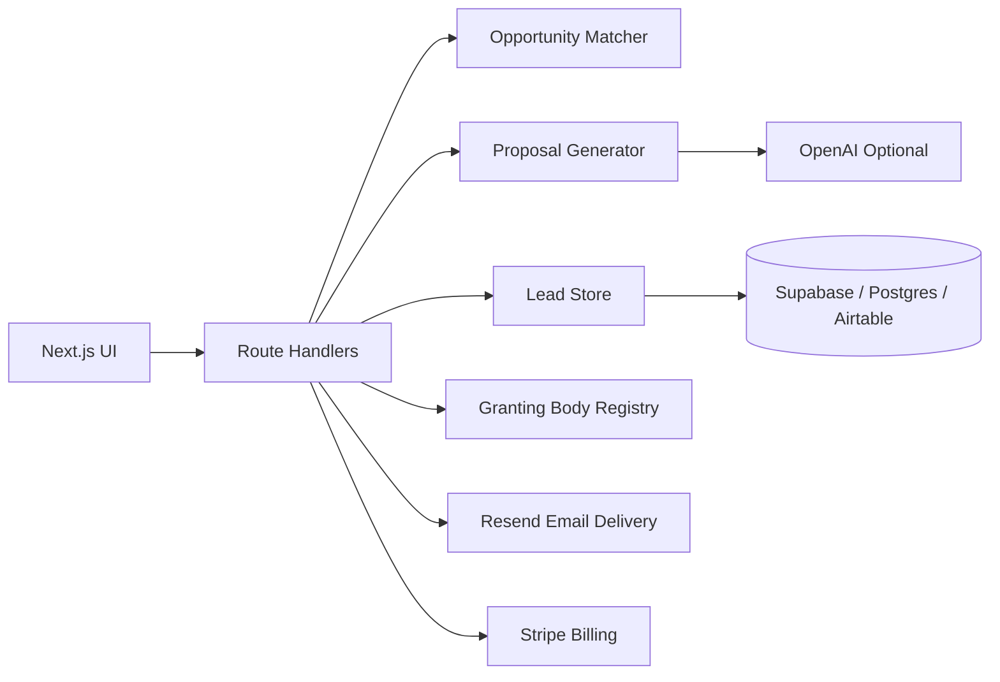
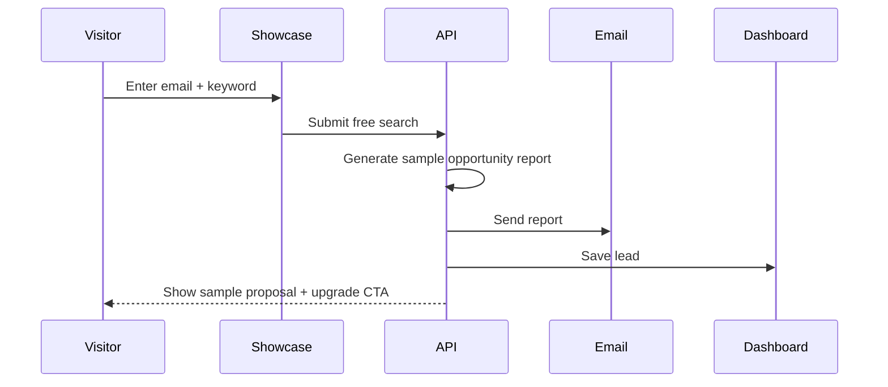

# Civisource

> AI-assisted procurement intelligence, grant discovery, lead capture, proposal generation, and subscription conversion for business development teams.


Civisource converts a simple business input — email, organization profile, and keywords — into a structured opportunity discovery and proposal pipeline.

It is designed for business conventions, chamber events, government-contracting demos, grant discovery workflows, and SaaS subscription conversion.

---

## Table of Contents

- [Overview](#overview)
- [Product Flow](#product-flow)
- [Core Features](#core-features)
- [Routes](#routes)
- [Architecture](#architecture)
- [Free Showcase Funnel](#free-showcase-funnel)
- [Email Campaign Sequence](#email-campaign-sequence)
- [Granting Body / Procurement Registry](#granting-body--procurement-registry)
- [Stripe Monetization](#stripe-monetization)
- [Installation](#installation)
- [Environment Variables](#environment-variables)
- [Vercel Deployment](#vercel-deployment)
- [Production Data Layer](#production-data-layer)
- [Roadmap](#roadmap)
- [Repo Structure](#repo-structure)

---

## Overview

Civisource is an opportunity intelligence and proposal automation platform developed by **Saga Dog Corp**.

The platform helps organizations move from broad capability descriptions to actionable procurement and grant opportunities.

It demonstrates how a business capability description can become:

- sector matching
- opportunity shortlisting
- priority ranking
- requirements extraction
- proposal preview generation
- email-delivered report
- lead capture record
- dashboard follow-up
- subscription upgrade path

---

## Product Flow



---

## Core Features

| Feature | Description |
|---|---|
| Opportunity Search | Bulk keyword search across procurement and grant-style sources |
| Proposal Preview | Generates a sample response structure for a selected notice |
| Requirements Checklist | Extracts likely requirements, eligibility, attachments, and deadlines |
| Lead Capture | Stores business email, keywords, organization profile, and selected notice |
| Email Report | Sends a generated opportunity report to the prospect |
| Lead Dashboard | Provides a CRM-lite interface for convention follow-up |
| Free Showcase | Allows one free search and sample proposal as a lead magnet |
| Stripe Upgrade | Converts users into paid subscription tiers |
| API Registry | Tracks public grant/procurement data sources for future integrations |

---

## Routes

### Core App

```text
/                  Homepage
/civisource        Landing page
/demo              Interactive demo
/sectors           Sector library
/leads             Lead dashboard
```

### Showcase Funnel

```text
/showcase          Free business convention showcase
/api/showcase      Showcase search + lead capture endpoint
```

### Demo APIs

```text
/api/demo/match       Matching API
/api/demo/proposal    Proposal generation API
/api/leads            Lead capture API
/api/leads/export     CSV export
```

### Source Registry

```text
/sources              Source registry index
/sources/[slug]       Source detail page
/api/sources          Source registry API
/api/sources?q=grants Filtered source search
```

### Billing

```text
/pricing              Pricing page
/billing/success      Checkout success page
/billing/cancel       Checkout cancel page
/api/stripe/checkout  Stripe Checkout endpoint
/api/stripe/portal    Stripe Customer Portal endpoint
/api/stripe/webhook   Stripe webhook endpoint
```

---

## Architecture



### System Layers

```text
User Interface
  ├─ Landing page
  ├─ Interactive demo
  ├─ Showcase form
  ├─ Pricing page
  └─ Lead dashboard

Application Layer
  ├─ Matching API
  ├─ Proposal API
  ├─ Lead API
  ├─ Source registry API
  └─ Billing API

Integration Layer
  ├─ OpenAI
  ├─ Resend
  ├─ Stripe
  ├─ SAM.gov / Grants.gov / other source APIs
  └─ CRM / database exports
```

---

## Free Showcase Funnel

The free showcase funnel is designed for high-volume lead capture at:

- business conventions
- chamber of commerce events
- procurement expos
- grant workshops
- consulting demos
- local business networking events

### Behavior



### Showcase Promise

> One free bulk keyword search with one generated sample proposal, delivered by email.

---

## Email Campaign Sequence

### Email 1 — Report Delivery

- Sends the generated opportunity report
- Includes selected notice summary
- Includes proposal preview
- Introduces paid upgrade path

### Email 2 — Follow-Up

- Sent after the first engagement window
- Emphasizes repeat search value
- Frames Civisource as a business development engine

### Email 3 — Conversion

- Positions subscription as recurring procurement intelligence
- Encourages upgrading to Starter, Professional, or Enterprise

---

## Granting Body / Procurement Registry

Registry file:

```text
data/granting-bodies.json
```

Initial public data/API targets:

- SAM.gov opportunities
- Grants.gov APIs
- Simpler.Grants.gov
- USAspending award intelligence
- EU Funding & Tenders
- TED API
- UK Contracts Finder
- UK Find a Tender
- World Bank document/data APIs

Recommended registry fields:

```json
{
  "name": "SAM.gov",
  "slug": "sam-gov",
  "type": "procurement",
  "region": "United States",
  "apiDocumentationUrl": "https://open.gsa.gov/api/get-opportunities-public-api/",
  "requiresApiKey": true,
  "notes": "Federal contracting opportunity search."
}
```

---

## Stripe Monetization

### Suggested Tiers

| Tier | Price | Positioning |
|---|---:|---|
| Starter | $299/month | Small business opportunity monitoring |
| Professional | $1,500/month | Proposal pipeline and recurring search automation |
| Enterprise | $7,500/month | Managed procurement intelligence and advanced reporting |

### Billing Capabilities

- Stripe Checkout
- Stripe Customer Portal
- Subscription lifecycle webhooks
- Tier-based feature gating
- Paid upgrade CTA from showcase report

### Recommended Stripe Events

```text
checkout.session.completed
customer.subscription.created
customer.subscription.updated
customer.subscription.deleted
invoice.payment_succeeded
invoice.payment_failed
```

---

## Installation

```bash
git clone https://github.com/pacobaco/civisource.git
cd civisource
npm install
cp .env.example .env.local
npm run dev
```

Local development URL:

```text
http://localhost:3000
```

---

## Environment Variables

Create `.env.local`:

```env
# Organization
CIVISOURCE_ORG_NAME=Saga Dog Corp
CIVISOURCE_CONTACT_EMAIL=jrodrig@ecoquipr.com
CIVISOURCE_HOMEPAGE=https://www.ecoquipr.com
NEXT_PUBLIC_APP_URL=http://localhost:3000

# Optional AI proposal generation
OPENAI_API_KEY=your_openai_key
OPENAI_MODEL=gpt-4.1-mini

# Email delivery
RESEND_API_KEY=your_resend_key
FROM_EMAIL=onboarding@resend.dev

# Stripe
STRIPE_SECRET_KEY=sk_test_...
STRIPE_WEBHOOK_SECRET=whsec_...
STRIPE_PRICE_STARTER=price_...
STRIPE_PRICE_PROFESSIONAL=price_...
STRIPE_PRICE_ENTERPRISE=price_...
```

---

## Required Dependencies

```bash
npm install resend openai stripe
```

Recommended base stack:

```bash
npm install next react react-dom
npm install -D typescript @types/node @types/react eslint
```

---

## Navigation Patch

Add these links to `app/layout.tsx` or the main navigation component:

```tsx
<Link href="/showcase">Free Showcase</Link>
<Link href="/pricing">Pricing</Link>
```

---

## Vercel Deployment

### Build Locally

```bash
npm run build
```

### Deploy

```bash
vercel --prod
```

### Add Environment Variables

```bash
vercel env add OPENAI_API_KEY
vercel env add RESEND_API_KEY
vercel env add STRIPE_SECRET_KEY
vercel env add STRIPE_WEBHOOK_SECRET
vercel env add NEXT_PUBLIC_APP_URL
```

### Suggested Production URLs

```text
https://www.ecoquipr.com/civisource
https://www.ecoquipr.com/demo
https://www.ecoquipr.com/showcase
https://www.ecoquipr.com/pricing
```

---

## Production Data Layer

Current demo state can use in-memory storage. For production, replace with one of:

- Supabase
- Vercel Postgres
- Neon
- Airtable
- HubSpot
- Google Sheets

Recommended entities:

```text
Lead
  ├─ id
  ├─ email
  ├─ organization
  ├─ keywords
  ├─ sector
  ├─ selectedNotice
  ├─ generatedReport
  ├─ subscriptionStatus
  ├─ createdAt
  └─ followUpStatus

Opportunity
  ├─ id
  ├─ source
  ├─ title
  ├─ deadline
  ├─ agency
  ├─ eligibility
  ├─ estimatedValue
  └─ url
```

---

## Repo Structure

```text
civisource/
├─ app/
│  ├─ page.tsx
│  ├─ civisource/page.tsx
│  ├─ demo/page.tsx
│  ├─ showcase/page.tsx
│  ├─ pricing/page.tsx
│  ├─ leads/page.tsx
│  ├─ sources/page.tsx
│  ├─ sources/[slug]/page.tsx
│  └─ api/
│     ├─ demo/match/route.ts
│     ├─ demo/proposal/route.ts
│     ├─ showcase/route.ts
│     ├─ leads/route.ts
│     ├─ leads/export/route.ts
│     ├─ sources/route.ts
│     └─ stripe/
│        ├─ checkout/route.ts
│        ├─ portal/route.ts
│        └─ webhook/route.ts
├─ components/
│  ├─ LeadForm.tsx
│  ├─ OpportunityCard.tsx
│  ├─ PricingCards.tsx
│  └─ ShowcaseReport.tsx
├─ data/
│  ├─ granting-bodies.json
│  └─ mock-opportunities.json
├─ lib/
│  ├─ matcher.ts
│  ├─ proposal.ts
│  ├─ email.ts
│  ├─ stripe.ts
│  └─ leads.ts
├─ public/
├─ README.md
├─ .env.example
├─ package.json
└─ vercel.json
```

---

## Roadmap

- [ ] Connect live SAM.gov opportunity search
- [ ] Connect Grants.gov and Simpler.Grants.gov APIs
- [ ] Add persistent lead database
- [ ] Add multi-user organization accounts
- [ ] Add proposal version history
- [ ] Add CRM export integrations
- [ ] Add customer portal billing page
- [ ] Add source scoring and compliance checklist extraction
- [ ] Add scheduled opportunity monitoring
- [ ] Add weekly email digest for subscribers

---

## Strategic Positioning

Civisource functions as:

```text
Opportunity Engine
+ Proposal Generator
+ Lead Capture System
+ CRM-lite Dashboard
+ Subscription SaaS Funnel
```

It can be used as a convention-grade demo, a local business prospecting tool, or a full SaaS platform for procurement intelligence.

---

## License

Proprietary. All rights reserved by Saga Dog Corp unless otherwise stated.
